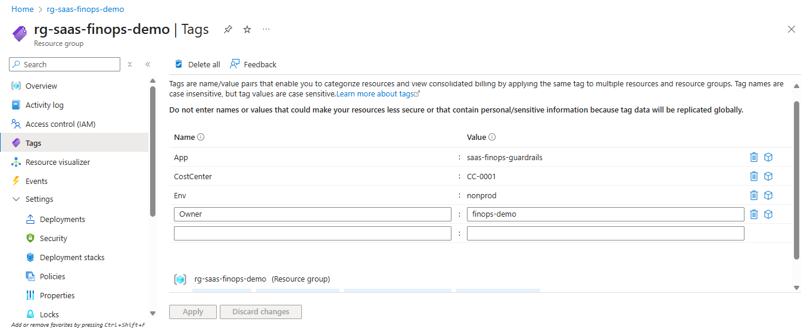
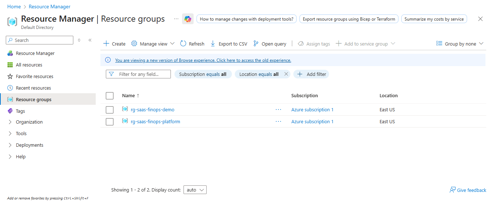
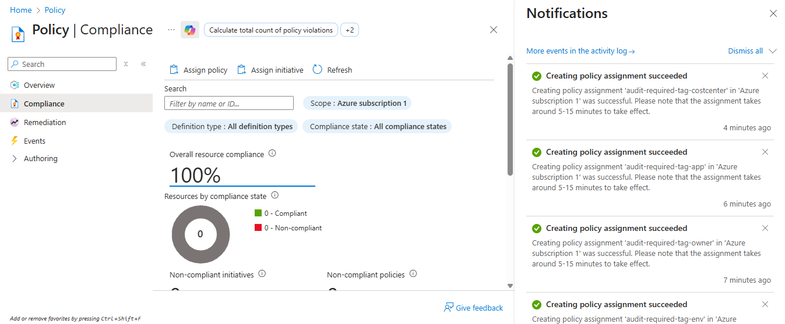
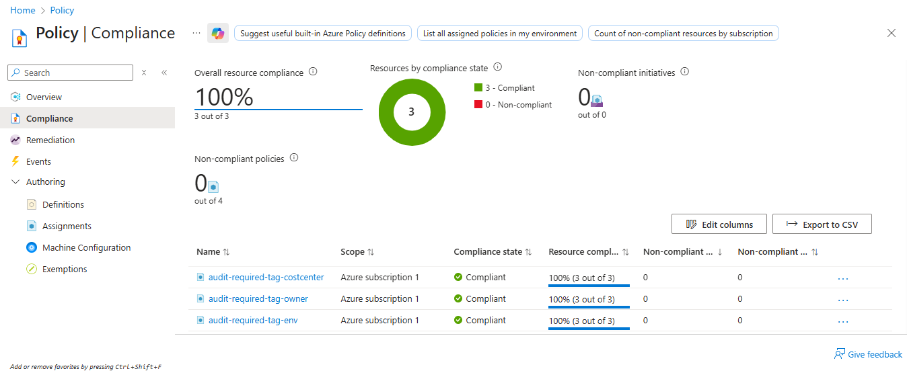
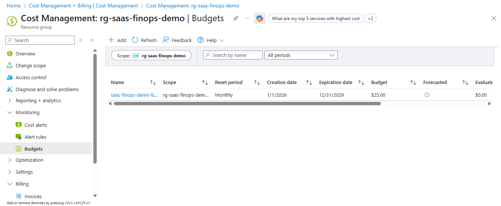

# Azure FinOps Guardrails: Discovering and Governing Cloud Spend

## Executive Summary (Video)

🎥 **This video explains:**
- How I identified cloud cost discoverability gaps in a SaaS environment
- Why missing ownership and tagging blocked FinOps maturity
- How Azure Policy exposed real-world governance friction
- How I applied controlled bootstrap exceptions without weakening long-term controls
- How budget guardrails restored visibility and accountability

https://github.com/user-attachments/assets/5361b770-df80-4b78-8a44-1ea36e652a0b

## Why I Built This Project

While working in a SaaS environment, I was asked a deceptively simple question:

> “Where is our cloud spend actually going?”

The problem wasn’t that costs were unavailable; Azure Cost Management existed.  
The problem was that **costs were not attributable**.

Resources existed across regions and services, but:
- Ownership wasn’t clear
- Application boundaries were fuzzy
- Budgets and alerts lacked context
- Investigations turned into manual archaeology

This project documents how I identified that gap and implemented **practical FinOps guardrails** to make cloud spend *discoverable, attributable, and governable* without breaking engineering velocity.

## The Core Problem I Identified

The root issue wasn’t tooling.  
It was **missing structure**.

Specifically:
- Sesources existed without consistent tags
- Cost reports grouped spend, but couldn’t explain it
- Alerts fired, but nobody clearly owned the response
- Governance controls existed, but weren’t aligned to real workflows

In short:  
We could see *how much* we were spending but not *who* or *why*.

## My Approach (High-Level)

Rather than jump straight to optimization or automation, I focused on **foundational FinOps hygiene**:

1. Establish a **minimum tagging standard**
2. Use **Azure Policy** to continuously audit compliance
3. Add a **budget guardrail** to surface risk early
4. Handle real-world governance friction intentionally (not dogmatically)

This mirrors how FinOps maturity actually works in production SaaS orgs.

## What I Implemented

### 1. Defined a Minimal, Enforceable Tagging Standard

> Tags were applied at the resource group level to establish
> a consistent attribution baseline.

I intentionally kept the standard small, only what was necessary to answer cost questions:

| Tag | Purpose |
|---|---|
| App | What logical workload owns this spend |
| CostCenter | How finance allocates the cost |
| Env | Production vs non-production |
| Owner | Who is accountable when costs spike |

This ensures that **every dollar can be explained** without creating tag sprawl.

🎥 **Video: Tagging Standards Walkthrough**

This short walkthrough shows:
- how the tagging standard was defined
- where tags were applied (resource group vs resource level)
- why these four tags were chosen as the minimum viable FinOps set

https://github.com/user-attachments/assets/dc0c6889-102b-48ef-b561-060014328bb5

### 2. Structured Resource Groups by Intent

> Resource groups were intentionally separated to distinguish
> workload enforcement from platform bootstrapping.

I separated resources into two logical scopes:

- **Workload Resource Group**
  - where application resources live
  - strict tagging + budget enforcement

- **Platform / Bootstrap Resource Group**
  - used for shared or foundational services
  - temporarily flexible during setup

This distinction proved critical once governance controls were applied.

### 3. Assigned Azure Policy at Subscription Scope (Audit Mode)

> Azure Policy was assigned at subscription scope using audit mode
> to surface gaps without breaking deployments.

I assigned built-in Azure Policy definitions to **audit** missing required tags.

Key decision:
- I intentionally started with **Audit**, not **Deny**
- The goal was visibility first, enforcement later

This allowed me to:
- observe existing gaps
- avoid breaking deployments
- create a baseline compliance signal

### 4. Encountered (and Documented) Real Governance Friction

> Once policies were active, governance correctly blocked
> the creation of an Action Group due to missing required tags.

Once policies were active, I hit a real-world issue:

Governance controls began blocking the creation of governance tooling itself.

Specifically:
- Creating an Action Group for budget alerts failed
- The resource was blocked for missing required tags

This is a common but under-documented problem:
**Governance can block governance** if not rolled out thoughtfully.

🎥 **Video: Policy Compliance & Non-Compliance in Practice**

This walkthrough captures:
- Azure Policy evaluation behavior
- Why resources initially appeared non-compliant
- How governance blocked Action Group creation
- How I validated compliance recovery without changing the configuration

https://github.com/user-attachments/assets/0fcb95b9-9993-486b-84fe-763358b48dcf

### 5. Applied a Controlled Bootstrap Exception

Rather than weakening policies globally, I:
- Applied a **temporary policy exclusion** to the platform resource group
- Completed initial setup
- Kept the workload resource group fully governed

This preserved the model's integrity while acknowledging real operational needs.

### 6. Verified Compliance and Cost Attribution

> After remediation and evaluation, policy compliance
> returned to 100%.

After tags were applied and policies re-evaluated:
- Subscription compliance returned to 100%
- Resources aligned with the tagging standard
- Cost reports could now be filtered meaningfully

An important observation:
- Azure Policy evaluation is **eventually consistent**
- Compliance does not update instantly after changes
- No additional configuration was required, only patience and verification

### 7. Added a Budget Guardrail for Immediate Visibility

> With governance in place, a resource group scoped budget
> could be safely enabled.

Finally, I added a **resource group scoped monthly budget** with alerts.

Why this mattered:
- Budgets surface risk early
- Alerts now had context (owner, app, env)
- Cost conversations became actionable instead of reactive

This was the fastest, highest-impact FinOps win.

## What This Project Demonstrates

This repository shows **real expense governance**:

- Missing tags causing cost ambiguity
- Governance rollout tradeoffs
- Policy evaluation delays
- Bootstrap exceptions done responsibly
- Budgets layered on top of governance (not instead of it)

These are the exact issues cloud teams face in production.

## Supporting Visual Evidence

All screenshots referenced above are stored in `/screenshots`
and are ordered to match the narrative flow of this README.

## Artifacts in This Repo

- `tagging-standard.md`  
  → the minimal tagging model I enforced

- `problem-context.md`  
  → the spend-discovery problem this solved

- `finops-decision-log.md`  
  → why each technical decision was made

- `/screenshots/`  
  → step-by-step visual evidence of the implementation

- `/videos/`  
  → narrated walkthroughs showing real portal behavior

## Why This Matters in Practice

This project wasn’t about saving $5 or $5000.

It was about enabling:
- Accountable ownership
- Faster incident response
- Meaningful cost conversations
- A foundation for future optimization and automation

FinOps only works when **engineering, finance, and governance speak the same language**.  
This project establishes that shared language.

## Next Steps I Would Take (If Extended)

- Bundle tag policies into an initiative
- Add remediation where supported
- evolve audit → deny once teams are trained
- codify the model in Bicep or Terraform
